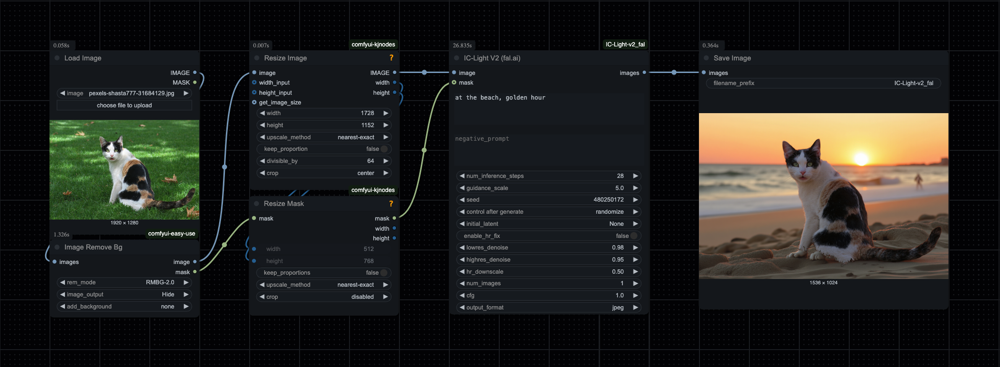

# ComfyUI_IC-Light-v2_fal

Custom node for [ComfyUI](https://github.com/comfyanonymous/ComfyUI) that integrates [lllyasviel's IC-Light V2 model](https://github.com/lllyasviel/IC-Light/discussions/98) into your workflows using the [fal.ai API](https://fal.ai/models/fal-ai/iclight-v2/api).



## Features

* Re-lighting photos and changing their backgrounds based on a given description
* Use your own native ComfyUI mask as input (optional)
* Adjustable generation parameters (seed, lighting direction, denoise strength, etc.)
* Multiple image generation in a single request

## Prerequisites

* ComfyUI installed and set up
* fal.ai account and API key

## Installation
You can install this custom node using the ComfyUI Manager or manually.

### Install via ComfyUI Manager
1. Install [ComfyUI Manager](https://github.com/Comfy-Org/ComfyUI-Manager) if you haven't already.
2. Open ComfyUI and click the "Manager" button.
3. Search for "ComfyUI_IC-Light-v2_fal" in the custom nodes section.
4. Click "Install" to automatically download and install the custom nodes.

### Install manually

1. Clone this repository into your ComfyUI's `custom_nodes` directory:
```
cd /path/to/ComfyUI/custom_nodes
git clone https://github.com/a-und-b/ComfyUI_IC-Light-v2_fal.git
```

2. Navigate to the cloned directory:
```
cd ComfyUI_IC-Light-v2_fal
```

3. Install the required dependencies:
```
pip install -r requirements.txt
```

4. Configure your API key:
   - Copy `config.ini.template` to `config.ini` in the root directory of this custom node (`ComfyUI/custom_nodes/ComfyUI_IC-Light-v2_fal`).
   - Add your [fal.ai API key](https://fal.ai/dashboard/keys) to the `config.ini` file 
   
5. Restart ComfyUI if it's already running

## Usage

After installation, you'll find the "IC-Light V2 (fal.ai)" node in the ComfyUI interface. Connect an input image and an optional mask to change the subject's background and lighting based on your prompt.

### Parameters

- **image**: Input image to be relit
- **prompt**: Text prompt describing the desired lighting or background
- **negative_prompt**: Negative prompt to guide the model away from certain concepts
- **num_inference_steps**: Number of denoising steps (impacts generation time and quality)
- **guidance_scale**: Higher values enforce the prompt more strictly
- **seed**: Random seed for reproducible results
- **initial_latent**: Lighting direction - None, Left, Right, Top, or Bottom
- **enable_hr_fix**: Enable high-resolution fix for better quality
- **lowres_denoise**: Strength for low-resolution pass
- **highres_denoise**: Strength for high-resolution pass (used with HR fix)
- **hr_downscale**: Downscale factor for high-resolution pass
- **num_images**: Number of variations to generate
- **cfg**: Classifier-Free Guidance scale for generation
- **output_format**: Output image format (JPEG or PNG)
- **mask** (optional): Mask to target specific areas of the image

## Example Workflow

You can load the JSON file from the `example_workflows` folder directly into ComfyUI (e.g., by dragging and dropping the file onto the ComfyUI window or using the 'Load' button).

This workflow incorporates custom nodes from the following widely used extension packages:
* [ComfyUI-Easy-Use](https://github.com/yolain/ComfyUI-Easy-Use)
* [ComfyUI-KJNodes](https://github.com/kijai/ComfyUI-KJNodes)

## License

This project is licensed under the MIT License - see the LICENSE file for details.

## Acknowledgements
* lllyasviel for the [IC-Light model](https://github.com/lllyasviel/IC-Light) 
* comfyanonymus for bringing us [ComfyUI](https://github.com/comfyanonymous/ComfyUI)
* behzad kazemi for the [Photo](https://www.pexels.com/photo/charming-calico-cat-on-a-sunlit-lawn-31684129/) used in the example workflow
* fal.ai for providing the [API endpoint](https://fal.ai/models/fal-ai/iclight-v2/api)